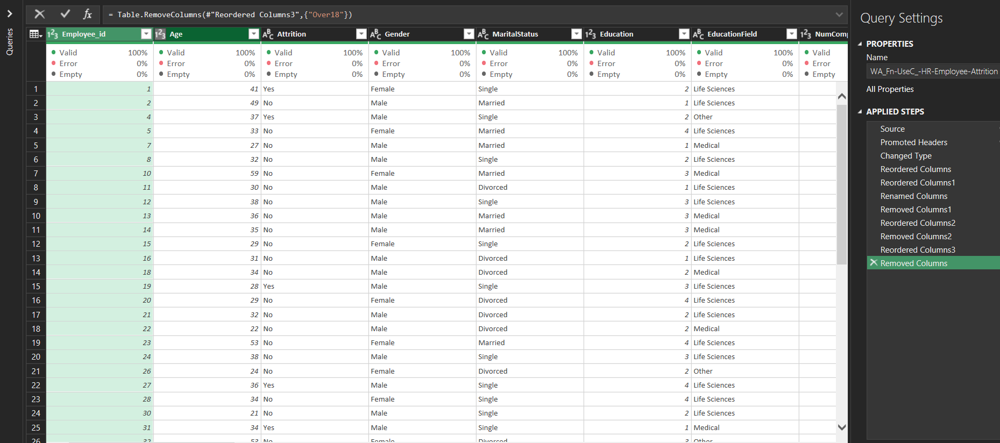
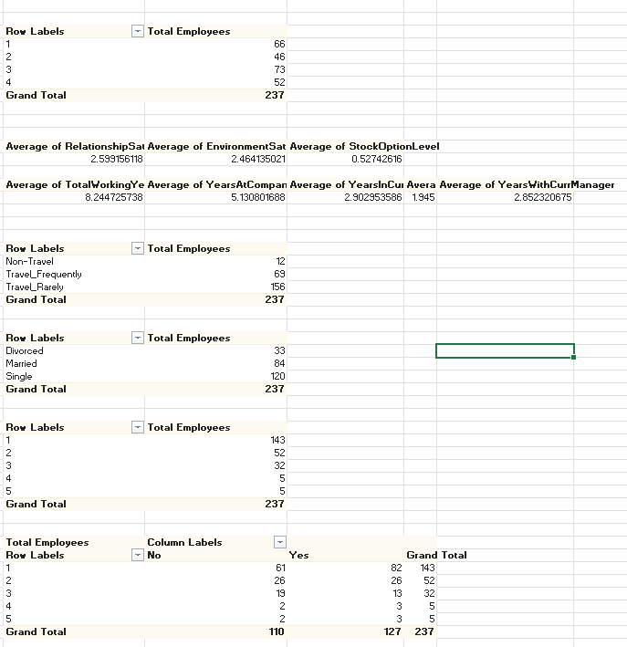
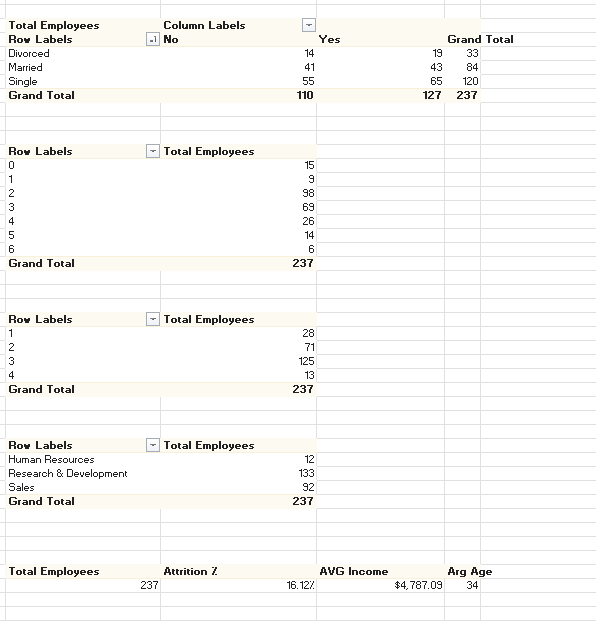
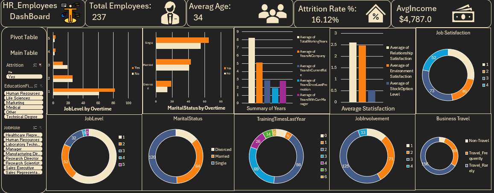

# 👨‍💼 HR Employee Attrition Analysis

## 📌 Overview
This project focuses on analyzing employee data to understand **attrition patterns** and identify the key factors that lead to employee turnover.

Using Excel, I performed data cleaning, exploratory data analysis (EDA), and built an interactive dashboard to generate actionable HR insights.

---

## 🧹 Data Cleaning (Power Query)

- Removed unnecessary columns and handled inconsistencies  
- Standardized data types (Age, Attrition, Education, etc.)  
- Cleaned categorical values for consistency  
- Prepared dataset for analysis  

---

## 📊 Pivot Tables & Analysis

  
  

- Employee distribution by departments and roles  
- Attrition comparison (Yes vs No)  
- Analysis by marital status, job level, and business travel  
- Aggregated metrics such as total employees and averages  

---

## 📈 Dashboard

### 🔹 Key KPIs
- Total Employees: **237**  
- Attrition Rate: **16.12%**  
- Average Age: **34**  
- Average Income: **$4,787**  

### 🔹 Visual Insights
- Attrition by Job Level  
- Attrition by Marital Status  
- Job Satisfaction distribution  
- Business Travel impact  
- Years at company & experience  

---

## 📊 Key Insights
- Employees with lower job levels show higher attrition rates  
- Single employees tend to leave more than married employees  
- Frequent business travel is linked to higher attrition  
- Some job roles (e.g., Sales & HR) show higher turnover  
- Job satisfaction and income play a major role in retention  

---

## 🛠️ Tools Used
- Microsoft Excel  
- Power Query  
- Pivot Tables  
- Data Visualization  

---

## 🚀 Outcome
Delivered a complete HR analysis project transforming raw employee data into actionable insights and building a dashboard to support better HR decision-making.

---

## 📁 Dataset
- `WA_Fn-UseC_-HR-Employee-Attrition.csv`
